<p align="center">
  
</p>

<h3 align="center">Build APIs at the speed of light.</h3>

<p align="center">
  一门自带 API 框架的通用编程语言。<br/>
  一种语言、一套协议、一套工具链 — 取代 REST、GraphQL 和 gRPC。
</p>

<p align="center">
  <a href="https://github.com/light-speak/luxo/actions/workflows/test.yml"></a>
  <a href="https://codecov.io/gh/light-speak/luxo"></a>
  <a href="https://goreportcard.com/report/github.com/light-speak/luxo"></a>
  <a href="https://go.dev"></a>
  <a href="LICENSE"></a>
</p>

<p align="center">
  <a href="README.md">English</a> ·
  <a href="#快速开始">快速开始</a> ·
  <a href="#语言特性">语言特性</a> ·
  <a href="#开发进度">开发进度</a>
</p>

---

## 为什么叫 "Luxo"？

**Luxo** /lɑːkèsuǒ/ — 数据从数据库到达客户端，这条路本该很短。

但我们把它走成了迷宫。JSON 在每个字段前都重复一遍名字，像一份每行都写着抬头的公文。GraphQL 在运行时才去解析查询，而那些查询在编译期就已经写死了。ORM 用反射一遍遍翻译结构体，做着编译器早就做完的事。`SELECT *` 把整张表捞出来，再亲手丢掉大半。

每一层都在重新发现上一层已经知道的答案。

我们退回到最开始，只问一个问题：**从存储到屏幕，最少需要几步？每一步最少需要多少字节？**

沿着这个问题走到底，就是 Luxo。

**Lux**（拉丁语，*光*）— 这不是一个比喻，而是一个工程约束。二进制编码在编译期确定，查询计划在编译期生成，字段选择贯穿客户端到 SQL — 每一层都在逼近传输的物理极限。数据应该像光一样到达：没有绕路，没有损耗。

**O**（*origin*，起源）— 一切从 Schema 开始，也只从 Schema 开始。数据库表、类型定义、编解码器、客户端 SDK，全部从同一份 `.luxo` 文件生长出来。没有第二个 source of truth，没有需要手动同步的定义，改一个字段名不需要同时动三个文件。

> **Luxo — 一个起源，光速抵达。**

## Luxo 是什么？

Luxo 是一门**编程语言** — 编译到 Go，自带 API 框架、自研协议和完整工具链。

写 `.luxo` 文件，得到：API 服务、数据库层、客户端 SDK、迁移文件、监控面板。不需要粘合代码。

```luxo
model User @crud {
  name:     String @filterable
  email:    String @unique
  password: String @hidden @hash
  role:     Role = Role.USER
  avatar:   String?
  posts:    [Post]
}
```

一段定义生成一切。零样板代码。

## 为什么不用...

| | GraphQL | gRPC | REST | **Luxo** |
|---|---|---|---|---|
| **字段选择** | ✅ 支持但过于松散，客户端可任意构造深层嵌套查询，需额外配置深度/复杂度限制防止滥用 | ❌ 不支持，响应固定为 proto 定义的完整结构（`FieldMask` 可实现但需手动处理） | ❌ 不支持，每个端点返回固定字段，需手动实现 `?fields=` 参数 | ✅ Schema 级别声明字段可见性，编译期校验选择合法性，贯穿到 SQL 只查所选列 |
| **二进制传输** | ❌ 规范不限编码格式，但实践中几乎只用 JSON，大数据量场景序列化开销显著 | ✅ Protobuf 二进制编码，高效紧凑 | ❌ 可通过 Content Negotiation 支持任意格式，但实践中以 JSON 为主，无标准二进制方案 | ✅ 开发环境 JSON 便于调试，生产环境自动切换 Binary 提升吞吐，零配置 |
| **一份 Schema** | ❌ SDL 定义 API 接口，但仍需独立维护 ORM 数据库映射，两处定义容易不同步（code-first 工具可缓解） | ❌ `.proto` 定义接口 + ORM 定义数据库，两套定义需手动保持一致 | ❌ 无 Schema 驱动，路由 / 模型 / 文档全部手写 | ✅ 一份 `.luxo` 生成 API 接口、数据库迁移、客户端 SDK 和文档，单一事实来源 |
| **N+1 防护** | ❌ Resolver 模式天然引发 N+1，需手动集成 DataLoader（已是标准实践，部分框架如 Hasura 可自动解决） | N/A 不涉及嵌套字段解析场景 | ❌ 嵌套资源需手动优化查询或引入预加载逻辑 | ✅ 编译器自动分析关联关系，生成 DataLoader 批量加载，无需手动干预 |
| **空安全** | ⚠️ SDL `!` 标记非空，服务端运行时校验；客户端可通过 codegen 获得编译期类型安全 | ✅ Protobuf 字段有默认零值，编译期类型安全（但 proto3 无法区分"零值"和"未设置"） | ❌ 无任何空安全保障，null 错误只能运行时发现 | ✅ 语言级编译期空安全：`?` 可空声明、`?.` 安全访问、`?:` Elvis 兜底，空值错误编译阶段拦截 |
| **错误处理** | ❌ `errors` 数组结构松散，仅有 message 字符串 + 可选 extensions，客户端难以结构化处理 | ✅ gRPC Status 标准 16 种状态码 + 富错误详情，类型明确 | ❌ 依赖 HTTP 状态码 + 自定义 JSON body，无统一错误结构规范 | ✅ `Result<T>` 类型化错误 + `?` 操作符自动传播，错误处理既安全又简洁 |
| **并发** | ⚠️ 多数实现自动并行执行独立 resolver（gqlgen / Apollo / graphql-java），但无语言级并发原语，复杂编排仍依赖宿主语言 | ❌ 支持双向流式传输，但并发编排逻辑需开发者手动管理 | ❌ 无内建并发支持，完全依赖框架或手写线程/协程管理 | ✅ 语言内建 `async` / `await` + `Channel` — 编译到 Go goroutine 和 channel，零成本并发 |
| **多服务** | ⚠️ Apollo Federation 成熟但运维复杂，需额外网关层和服务间协调 | ⚠️ 原生点对点 RPC 调用，但多服务编排仍需服务网格/发现（Istio、Consul 等） | ❌ 服务间调用需手写 HTTP 客户端或引入额外框架 | ✅ `extend` 跨服务扩展类型 + 内建网关路由 + 原生 RPC 调用，多服务协作开箱即用 |
| **扩展性** | ❌ 单体迁移到 Federation 需要重写 resolver、添加 `@key`/`@external` 注解、部署 Apollo Router | ❌ 服务拆分需要重新定义 `.proto`、重新生成 stub、重写调用代码 | ❌ 每次拆分都要新建路由、新写 HTTP 客户端、新建部署配置 | ✅ 单服务 → 多服务只改配置，零代码变更，Luvia 网关自动处理一切 |

## 语言特性

Luxo 是一门真正的编程语言 — 不只是 Schema DSL。**31 个关键字**，6 种核心类型（`Int`、`Float`、`String`、`Boolean`、`DateTime`、`Duration`），简洁语法，编译到 Go。

### 空安全

```luxo
val user = User.find(id: 1)        // User?（可空）
val name = user?.name               // 安全访问
val sure = user ?: throw NotFound   // Elvis — 断言或抛错
```

### 模式匹配 — `when`

`when` 取代 if/else 多分支逻辑：

```luxo
val level = when(score) {
  in 90..100 -> "A"
  in 80..89  -> "B"
  else       -> "C"
}

when(result) {
  is Ok  -> result.value
  is Err -> throw result.error
}
```

### Result 类型 + `?` 操作符

错误用 `?` 传播 — 不需要 try/catch，不需要 async/await 传染。

```luxo
val user = findUser(1)?              // Ok → 取值，Err → 自动 throw
val data = http.get(url)?            // 错误自动传播
```

### 并发 — 没有 async/await 传染

```luxo
// 所有调用看起来都是同步的 — Go runtime 自动调度
val user = fetchUser(1)              // 不需要 await

// 并发执行 — 只在需要时用
val (user, posts) = await {
  fetchUser(1)                       // 同时跑
  fetchPosts(1)                      // 同时跑
}

// 启动后台任务
async {
  sendEmail(user.email, "Welcome!")
}

// Channel — 编译到 Go channel
val ch = Channel<Int>(10)
ch <- 42                             // 发送
val value = <-ch                     // 接收
```

### yield — for 循环作为表达式

```luxo
val found = for item in items {
  if item.special { yield item }     // 退出循环并返回值
}
// found: Item? — yield 的值，未找到则 null
```

### 变量 — `val` + `var`

```luxo
val name = "不可变"                   // 不可变（全局 + 局部）
var count = 0                        // 可变（仅限局部）
count += 1
```

### 集合操作

```luxo
val total = items.sumOf { it.price * it.quantity }
val active = users.filter { it.status == "active" }
val names = users.map { it.name }.joinToString(", ")
val vip = users.any { it.role == Role.VIP }
```

### API 定义 — 三个层级

```luxo
// 1. 零代码 — 框架自动生成
api getUser(id: Int): User @cache(ttl: 60)

// 2. 带逻辑 — 用 Luxo 写
api register(input: RegisterInput): AuthResult {
  input.password.length >= 8 ?: throw PasswordTooShort
  val user = User.create(name: input.name, email: input.email, password: input.password)
  val token = generateToken(user, expires: 7d)
  AuthResult { token, user }         // 简写 — 字段名 = 变量名
}

// 3. 复杂逻辑 — 用 Go 写
api oauthLogin(provider: String, code: String): AuthResult @native
```

### 模块 — `use`

```luxo
use http                             // 标准库导入
use common.{ Base, Page }           // 展开导入
```

### 当前用户 — `my`

```luxo
api createPost(title: String): Post @auth {
  val post = Post.create(title: title, userId: my.id)
  post
}
```

### 事件 — `event` / `emit` / `on`

```luxo
event OrderCreated(order: Order, userId: Int)    // 类型化事件声明

api placeOrder(id: Int): Order @auth {
  val order = Order.create(userId: my.id)
  emit OrderCreated(order: order, userId: my.id) // 类型化 emit
  order
}

on OrderCreated { order ->                       // 事件监听
  "order created".i                              // .i = info 日志
}
```

### 调试链 — `.d`

```luxo
val user = User.find(id: 1).d        // .d 打印并返回自身
```

### 字段选择 — 贯穿全链路

```
getUser(1) {
  name email
  posts { title comments { content user { name } } }
}
```

客户端选字段 → API 只序列化这些 → SQL 只查这些。端到端。

### 实时流

```luxo
api watchComments(postId: Int): stream Comment
```

## 快速开始

```bash
go install github.com/light-speak/luxo/cmd/luxo@latest

luxo init my-app
cd my-app
luxo dev
```

## 架构

<p align="center">
  
</p>

**Luvia 始终在线** — 单服务时内嵌运行（进程内调用，零开销），多服务时独立部署为网关。同一套代码，同一套行为，只改配置。从原型到生产，不改一行代码。


## AI 原生设计

Luxo 不只是代码更短 — 它是 **AI 写后端最可靠的语言**。

| | 传统方案 (Go/TS) | Luxo |
|---|---|---|
| **AI 需要的上下文** | 50+ 文件，10K+ tokens | 1 个 `.luxo` 文件，~500 tokens |
| **AI 输出正确性** | 能编译 ≠ 正确，靠测试 | 编译器检查类型、空安全、穷举 |
| **代码风格一致性** | AI 每次选不同写法 | 一件事一种写法 |
| **理解业务** | AI 要从代码反推 | Schema 就是业务 |

```
"加一个商品收藏功能"

→ AI 生成 15 行 .luxo
→ 编译器校验类型、空安全、必填字段
→ 搞定，API 跑起来了

同样的事用 Go？200+ 行，7 个文件
同样的事用 TypeScript？150+ 行，4 个包，零编译期安全
```

**Luxo + AI = 可靠的后端工程师。** 其他语言给 AI 太多自由度，Luxo 给 AI 刚好够用的约束。

## 开发进度

### Phase 1 — 编译器 ✅
- [x] 词法分析 · 语法分析（31 关键字，Pratt Parser）
- [x] 语义分析（类型检查、空安全、字段注入）
- [x] LSP 服务器（诊断、补全、悬停、跳转定义、引用查找）
- [ ] Go 代码生成

### Phase 2 — 运行时 + Luvia
- [ ] Go 代码生成（model · api · db · dataloader · native 接口）
- [ ] 类型安全查询构建器（pgx，字段选择 → SQL）
- [ ] Luvia 网关（始终在线：单服务内嵌 / 多服务独立）
- [ ] 自动 CRUD · @native 智能合并
- [ ] JSON 传输 + 字段选择（端到端贯穿）
- [ ] 认证（@auth · JWT · Identity · `my` 关键字）
- [ ] 迁移引擎（声明式 diff · 安全回滚）
- [ ] i18n 错误体系 · 校验注解
- [ ] WebSocket 流式 · Batch 请求
- [ ] 事件系统（emit / on · NATS JetStream）

### Phase 3 — 多服务 + Binary
- [ ] Schema 组装 · 服务发现 · 负载均衡
- [ ] @service RPC（类型安全跨服务调用）
- [ ] extend 字段聚合（并行扇出）
- [ ] 熔断器 · 健康检查
- [ ] Binary 协议（field ID · varint · field mask）
- [ ] 客户端 SDK 生成（TypeScript · Dart）

### Phase 4 — AI + 生态
- [ ] MCP Server（AI 直接读写 .luxo 项目）
- [ ] luxo-ai（自然语言 → .luxo → 运行中的 API）
- [ ] luxo-copilot（基于 schema 的 AI 补全，VS Code / Cursor）
- [ ] Luxo Studio（监控 · 追踪 · API Playground）
- [ ] Cache / Task / Scheduler / Storage / Mail
- [ ] .luxo 测试运行器
- [ ] k3s 部署生成

## 贡献

Luxo 处于早期开发阶段，欢迎贡献代码、提出想法和反馈。

## 许可证

Apache-2.0 · Copyright 2026 light-speak
